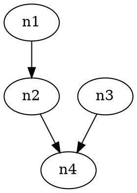
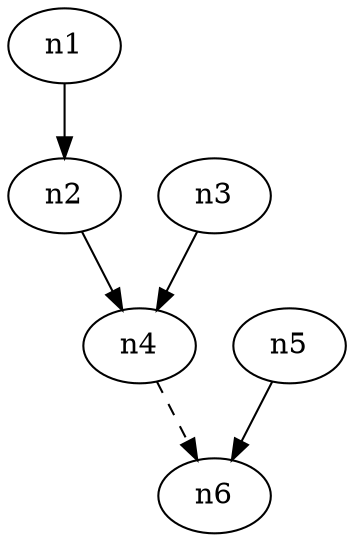
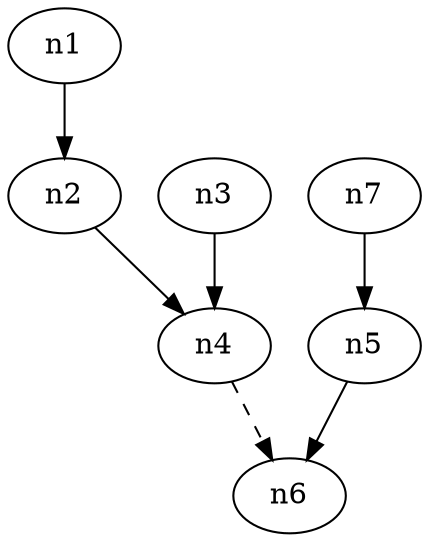

# Taskflow


Taskflow 是Java语言实现的一个DAG执行引擎，旨在帮助在程序中管理复杂的依赖关系，实现最大程度的并行化执行。

# Taskflow 设计与核心原理

---
Taskflow 以非常简明的方式定义图节点与依赖关系，有三个概念：
* 任务（Task）：真实需要被执行的任务，具体业务逻辑写在。
* 节点（TaskNode）：DAG中的节点，是任务执行的单元。
* 任务流（TaskFlow）：多个节点和边组成的DAG。

Taskflow 主要使用 Java 8 的```CompletableFuture```链式组合实现任务的依赖管理，核心代码仅百余行。


# 开始你的第一个DAG程序

定义一个具体的自定义任务类，需要实现框架中的ITask接口。核心是需要实现preprocess和execute函数。这个例子中，处理逻辑就是对上游输入的数据加和并再加1。
```java
public class AddOneTask implements ITask<Integer> {
    @Override
    public void setNode(INode<Integer> node) {}

    @Override
    public String getDescription() {
        return null;
    }

    // 如何处理上游依赖的多个结果，本函数的输出将会作为下面execute函数的输入
    @Override
    public Integer preprocess(List<Integer> results) {
        return results.stream().reduce(Integer::sum).orElse(0);
    }

    // 本任务的核心处理逻辑
    @Override
    public Integer execute(Integer input) {
        int result = 0;
        if (input != null) result += input;

        try {
            Thread.sleep(1000L);
        } catch (InterruptedException ignored) {
        }

        return ++result;
    }
}
```
描述DAG关系并执行：
```java
public static void main(String[] args) {
    ExecutorService executorService = Executors.newCachedThreadPool();
    TaskFlow<Integer> flow = new TaskFlow<>(executorService);
    // 创建任务节点
    TaskNode<Integer> node1 = flow.createNode("n1", new SquareTask());
    TaskNode<Integer> node2 = flow.createNode("n2", new SquareTask());
    TaskNode<Integer> node3 = flow.createNode("n3", new SquareTask());
    TaskNode<Integer> node4 = flow.createNode("n4", new SquareTask());
    // 描述依赖关系
    node3.addDependency(node1);
    node3.addDependency(node2);
    node4.addDependency(node3);

    System.out.println("answer:" + node4.get());

    // 关闭线程池
    executorService.shutdown();

    // 打印DOT格式
    System.out.println(flow.dump());
}
```
执行后会得到结果```answer:4```。
其中，执行耗时是3秒，取决于n4的最长依赖路径，即n1,n2,n4。

# DAG可视化
上面例子的最后，把flow打印了出来:

可以通过工具看到DAG可视化效果，如 https://dreampuf.github.io/GraphvizOnline


# 弱依赖
节点的依赖，默认都是强依赖，也就是需要等待所依赖的强依赖节点都完成以后，才可以开始自身节点的逻辑执行。
还有一种弱依赖，自身节点不用等待弱依赖节点完成，就可以执行自身逻辑，但可以在运行过程中动态获取弱依赖节点的结果（如果没有声明弱依赖关系，不允许动态获取，会抛出错误）。

下面看具体例子：

新增一个任务```CustomTask```，它的核心逻辑是： 当上游输入总和如果是偶数，则动态依赖n4节点的结果，如果是奇数，则直接做运算。
```java
public class CustomTask implements ITask<Integer> {

    private INode<Integer> node;
    @Override
    public void setNode(INode<Integer> node) {
        this.node = node;
    }

    @Override
    public String getDescription() {
        return null;
    }

    @Override
    public Integer preprocess(List<Integer> results) {
        return results.stream().reduce(Integer::sum).orElse(0);
    }

    @Override
    public Integer execute(Integer input) {
        int result = 0;
        if (input != null) result += input;

        // 核心逻辑： 上游输入如果是偶数，则动态依赖n4节点的结果，如果是奇数，则直接运算。
        if (result % 2 == 0) {
            int n4Result = this.node.getDependencyResult("n4");
            result += n4Result;
        }

        try {
            Thread.sleep(1000L);
        } catch (InterruptedException ignored) {
        }

        return ++result;
    }
}
```

然后在丰富一下DAG，增加n5，n6节点：
```java
public static void main(String[] args) {
        ExecutorService executorService = Executors.newCachedThreadPool();
        TaskFlow<Integer> flow = new TaskFlow<>(executorService);
        // 创建任务节点
        TaskNode<Integer> node1 = flow.createNode("n1", new SquareTask());
        TaskNode<Integer> node2 = flow.createNode("n2", new SquareTask());
        TaskNode<Integer> node3 = flow.createNode("n3", new SquareTask());
        TaskNode<Integer> node4 = flow.createNode("n4", new SquareTask());
        // 描述依赖关系
        node2.addDependency(node1);
        node4.addDependency(node2);
        node4.addDependency(node3);

        TaskNode<Integer> node5 = flow.createNode("n5", new SquareTask());
        TaskNode<Integer> node6 = flow.createNode("n6", new CustomTask());
        node6.addWeakDependency(node4);
        node6.addDependency(node5);

        // 在flow.execute种执行，可以设置各节点的默认输入，以及可以实现最大并行化执行
        flow.execute(0, ()->{
            System.out.println("answer:" + node6.get());
        });

        // 关闭线程池
        executorService.shutdown();

        // 打印DOT格式
        System.out.println(flow.dump());
    }
```

执行之后，得到如下的DAG结构:



输出结果是 ```answer:2```, 实际上只有n5, n6的节点起作用了。执行的耗时是2秒。

为了使得n6节点能用到n4节点的结果，我们调整一下依赖关系，增加一个n7节点，并让n5依赖n7：
```java
TaskNode<Integer> node7 = flow.createNode("n7", new AddOneTask());
node5.addDependency(node7);
```
修改后的DAG如下：



输出结果是 ```answer:7```, 执行的耗时是4秒。

为什么是4秒？ 回顾下n6节点的核心处理逻辑：
```java
// 核心逻辑： 上游输入如果是偶数，则动态依赖n4节点的结果，如果是奇数，则直接运算。
if (result % 2 == 0) {
    int n4Result = this.node.getDependencyResult("n4");
    result += n4Result;
}
```
直观上看，n6强依赖的n7，n5运行完毕已经需要2秒，自身执行需要1秒，这时候再临时起意去依赖n4的结果，n4运行完毕需要3秒，应该一共是需要6秒。
但是，由于代码是放到```flow.execute```里最大化并行执行的，在n7，n5运行的同时，其他节点已经尽可能提前去执行了。所以总耗时减少了。
